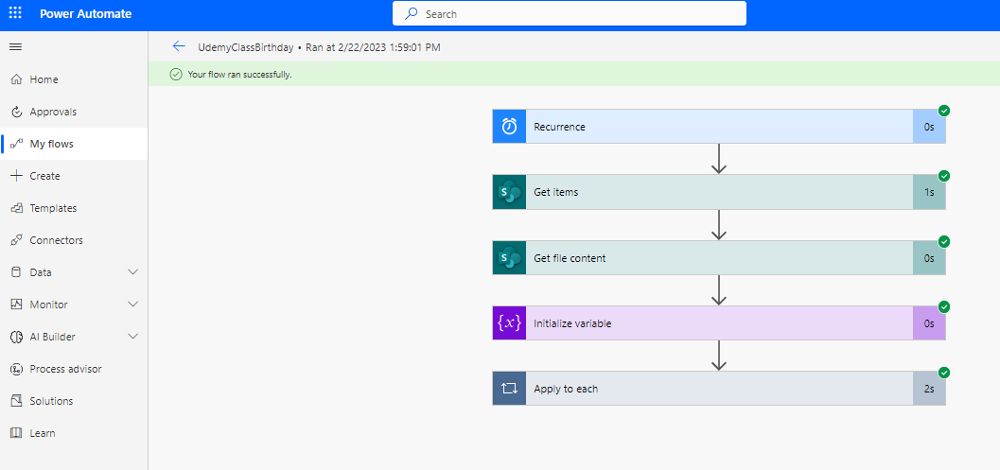

# Automate Employee Birthday Celebration message (Power Automate)
## Introduction
Banks are known to send messages on birthdays and special anniversaries in Nigeria, sometimes this help to boost morale when an organization celebrates employees on their special day, it gives them a feeling of love and a sense of relevance. This is a way that organizations can be closer and more empathetic to their employees, it gives the employee a sense of belonging to a community that values them. Sometimes this activity is done by one person, who has to check the calendar every day and keep track of whose birthday it is, and send a composed email to whomever birthday falls on that particular current day.
## Solution Overview
i built a basic database at the back end where all the data were stored such as Excel, SharePoint list, and power automate will help check once every day, and the employee whose birthday is on that day, is going to send that employee a precomposed customized message. This allows HR to care more for people and also improves employee morale which in turn would improve employee productivity.
## Some of the services used are,
- SharePoint List, to store the data.
- Power Automate as a frontend
- MS Outlook for sending mail.
## Power Automate Flow Overview

